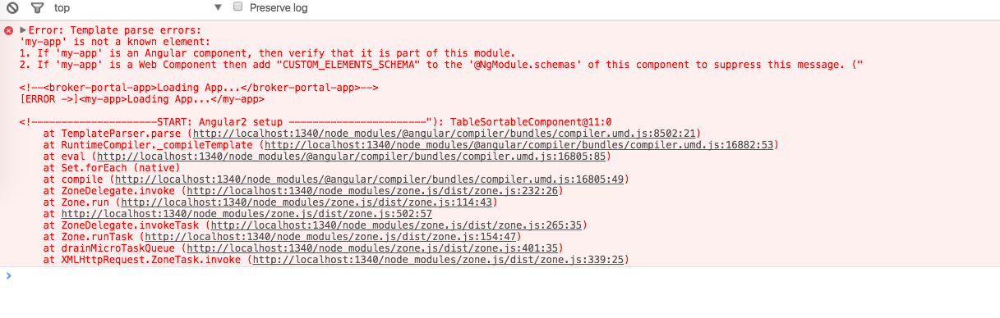
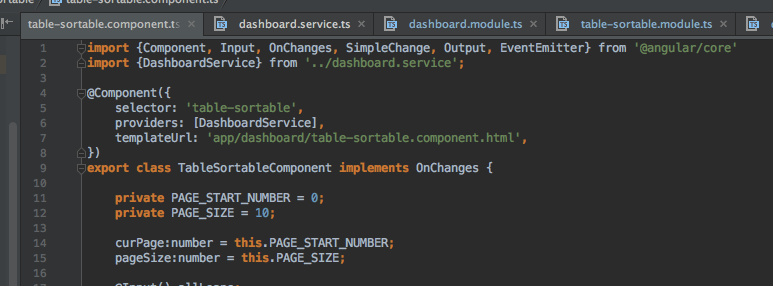

##### Solution : Can’t bind to ‘ngModel’ since it isn’t a known property of ‘input’
link: http://jsconfig.com/solution-cant-bind-ngmodel-since-isnt-known-property-input/
Basically, what we have to do is import the **FormsModule** from '@angular/forms' into the target module.

##### Misleading error message
If you see the error message like below, ignore the 'my-app' error part, keep reading till the component `TableSortableComponent`. 

The cause of the error here is the templateUrl in the TableSortableComponent does not point to the right url.

The current templateUrl should be `'app/dashboard/table-sortable/table-sortable.component.html'`
